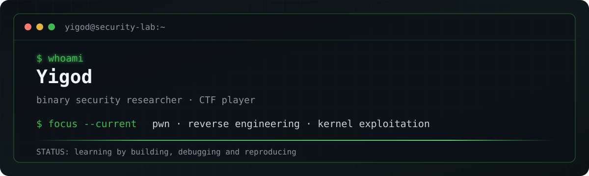

<p align="center">
  
</p>

<p align="center">
  <a href="https://blog.yigod.top">Blog</a>
  ·
  <a href="https://github.com/Yigods?tab=repositories">Projects</a>
  ·
  <a href="https://github.com/Yigods/pwn2heap">Pwn2Heap</a>
</p>

## `$ cat profile.txt`

```text
role      : Binary Security Researcher / CTF Player
interests : Pwn · Reverse Engineering · Linux Kernel Exploitation
languages : C · C++ · Python · x86 / x86_64 Assembly
workflow  : read source → reproduce behavior → build primitives → verify the chain
```

## Focus

- Building and solving reproducible Pwn challenges, from heap fundamentals to modern glibc exploitation.
- Reverse engineering native binaries and understanding the runtime rather than relying on one-shot templates.
- Learning Linux kernel exploitation with an emphasis on first principles and reliable local reproduction.

## Toolbox

`C` · `C++` · `Python` · `GDB` · `pwndbg` · `pwntools` · `Linux` · `Docker` · `IDA` · `Ghidra`

## Selected work

- [`pwn2heap`](https://github.com/Yigods/pwn2heap) — a progressive set of Pwn challenges, covering UAF, tcache, FSOP, `setcontext`, SROP and ORW.
- [`LibcSearcherMax`](https://github.com/Yigods/LibcSearcherMax) — extended libc identification data for CTF and local exploitation research.
- [`blog.yigod.top`](https://blog.yigod.top) — notes and write-ups.

## Notes

I value a workflow that can be explained and reproduced: map the runtime, validate one primitive at a time, then turn it into a stable exploit chain. AI can accelerate exploration; understanding the allocator, ABI and control flow is still the foundation.

---

<p align="center"><sub>Built without external stats APIs, animated SVG services, badge endpoints or third-party CDN assets.</sub></p>
